# Minha participação no Microsoft AI Tour 2026 em São Paulo-SP

Fotos e informações gerais sobre minha participação no Connection Hub Experts de Foundry IQ & Foundry Tools, durante a edição 2026 do Microsoft AI Tour em São Paulo-SP em 11/02/2026 (quarta-feira).

Público que passou pelo espaço: **40 participantes (estimativa)**

Tecnologias e tópicos abordados: **Inteligência Artificial, MCP, RAG, Agents, Microsoft Foundry, Foundry IQ, Azure AI Search, OpenTelemetry, Containers, Docker, Azure Monitor, Application Insights, Grafana, Azure Functions, Azure App Service, Datadog, Microsoft Agent Framework, .NET, C#, Python, Azure Container Registry, OneLake, Azure Storage, Azure Service Fabric, Azure SQL Database, Azure Cosmos DB...**

Durante o evento estive em algumas discussões técnicas com o **Victor Yrigiyen Rodrigues (Microsoft)** e o **Igor de Aguiar (Microsoft)** junto a participantes, abordando o uso do **Microsoft Foundry**, **Foundry IQ**, integrações com **MCP Servers**, **Microsoft Agent Framework** e a implementação de **observabilidade/monitoramento** em soluções de IA (via **OpenTelemetry**, com alternativas como **Azure Monitor/Application Insights, Grafana, Datadog...**).

A seguir temos um diagrama de uma arquitetura possível baseada na adoção do **Foundry IQ** e apresentada a partipantes que passaram pelo Hub, com o uso de alguns serviços que integram o **Microsoft Azure**:

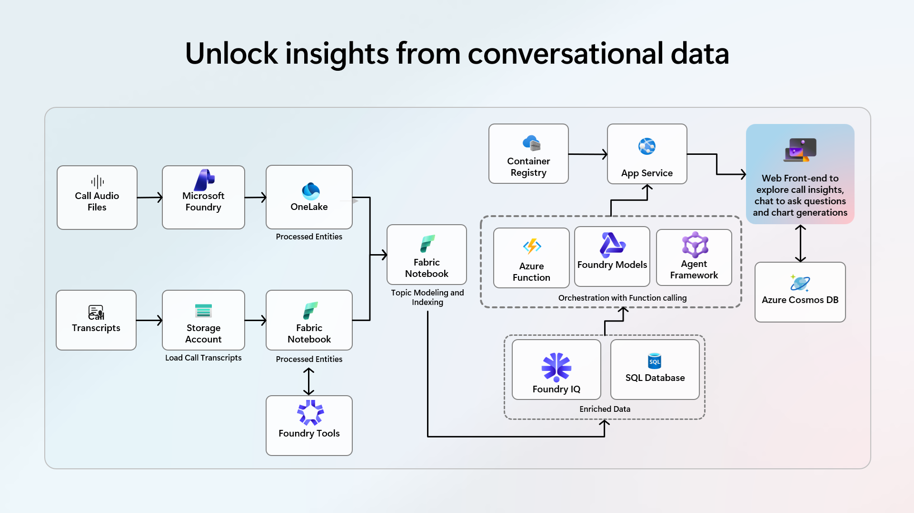

---

Local do evento: **Transamerica Expo Center - Av. Dr. Mário Vilas Boas Rodrigues, 387 - Santo Amaro - São Paulo - SP - CEP: 04757-020**

Site do evento: **https://aitour.microsoft.com/flow/microsoft/saopaulo26/landingpage/page/cityhome**

Deixo aqui meu agradecimentos à **Microsoft**, em especial à **Cristina González Herrero**, ao **Felipe Amaral**, ao **Victor Yrigiyen Rodrigues** e ao **Igor de Aguiar** pela oportunidade e todo o apoio para que eu participasse do **Connection Hub Station** nesta edição do **Microsoft AI Tour** em **São Paulo-SP**.

Invite da Microsoft solicitando minha participação no **Connection Hub Station de Foundry IQ & Foundry Tools**:

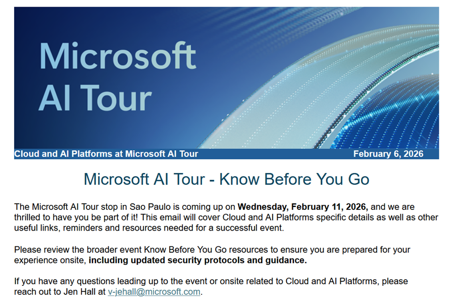

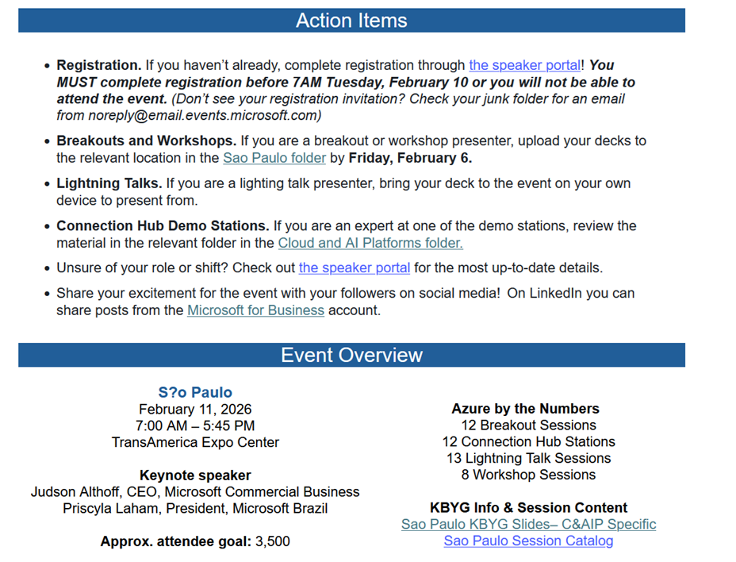

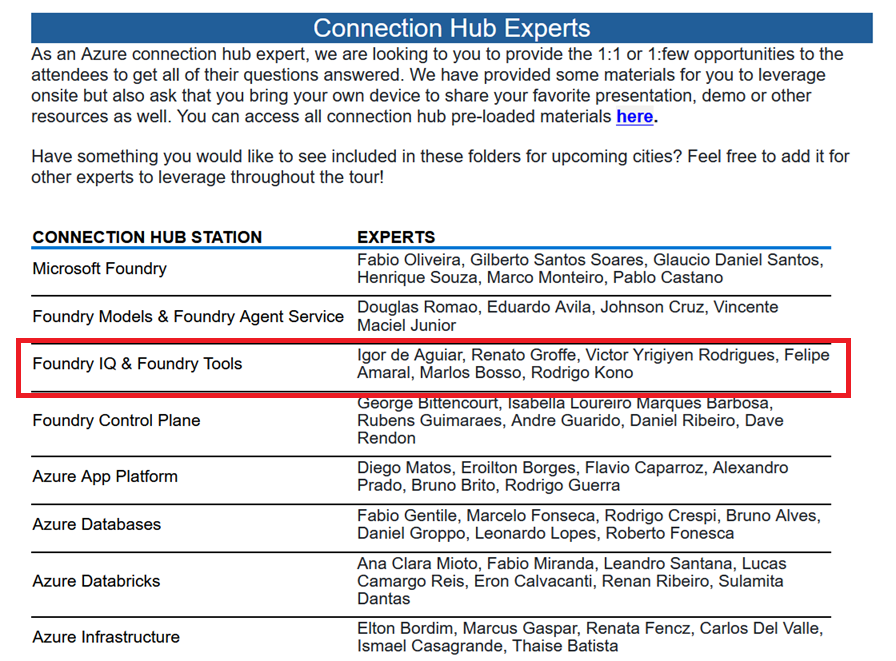

Agradecimentos da Microsoft:

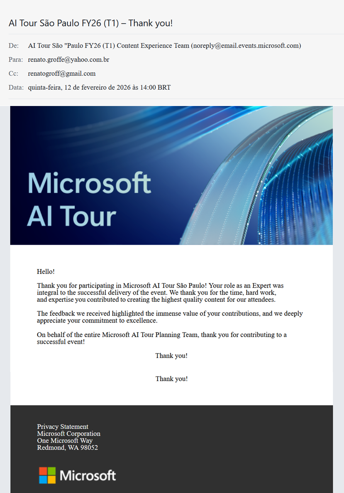

Fotos no evento:

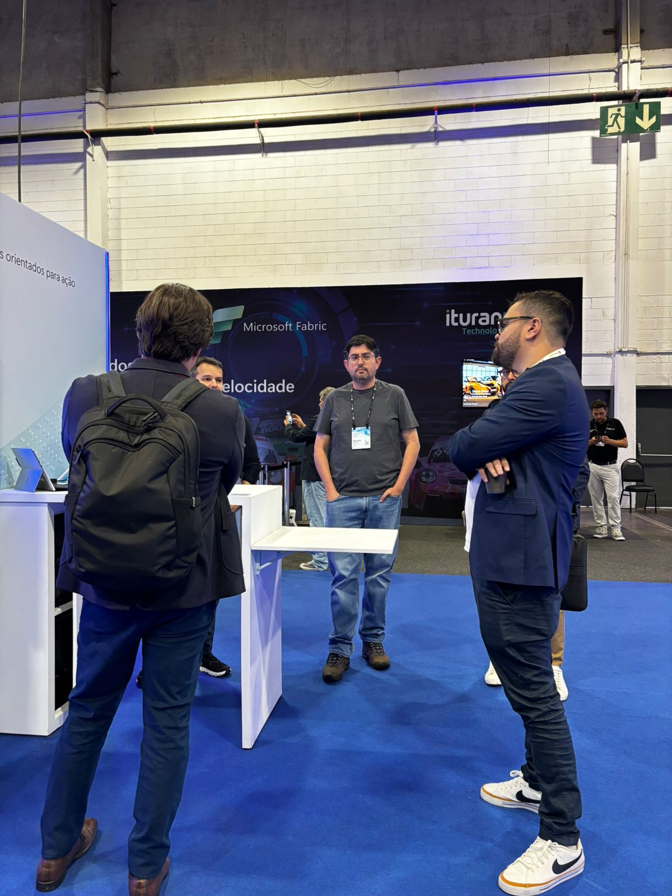

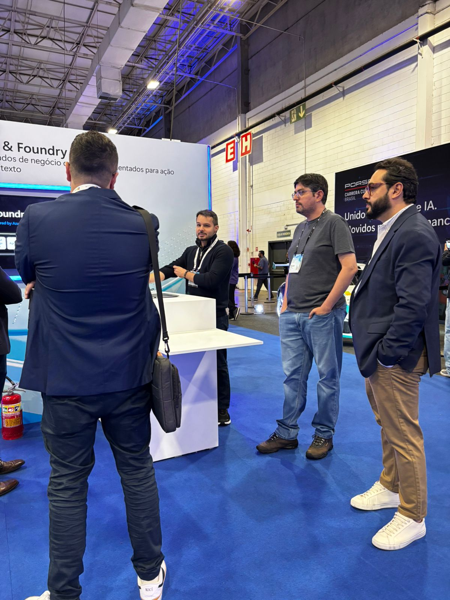

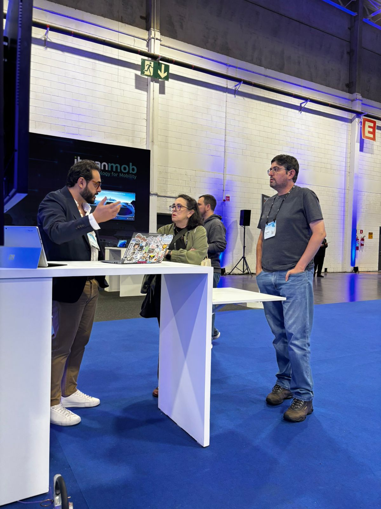

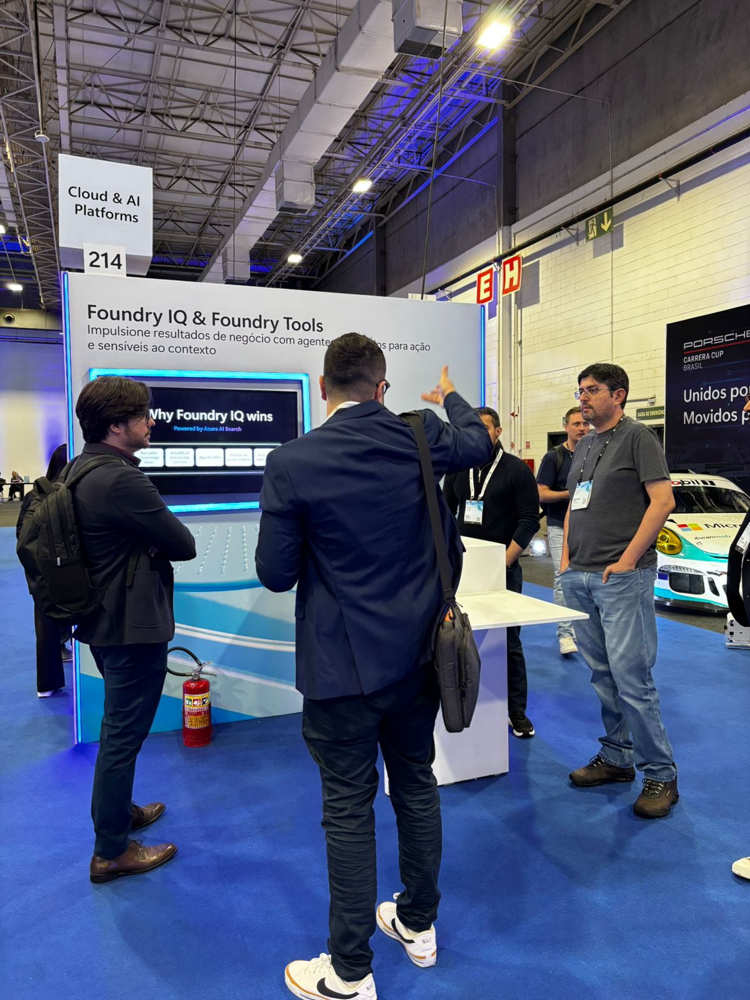

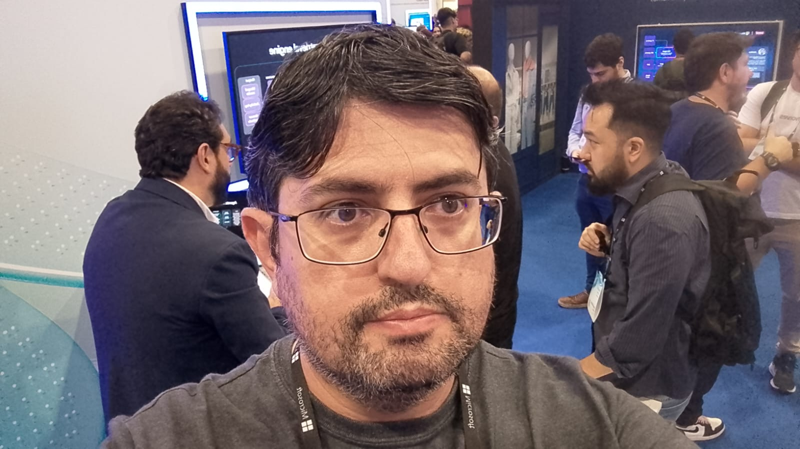

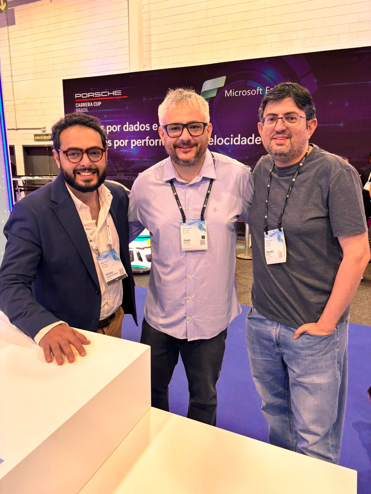

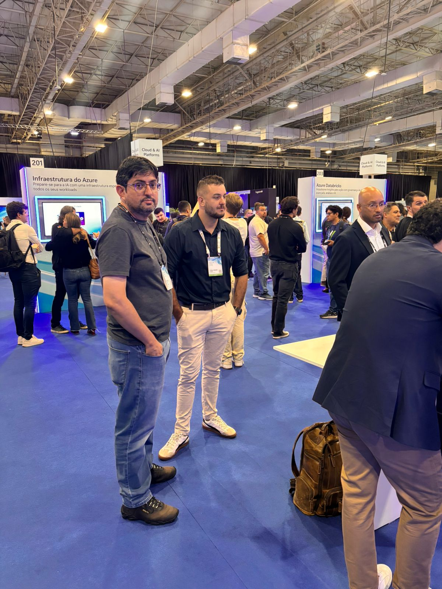

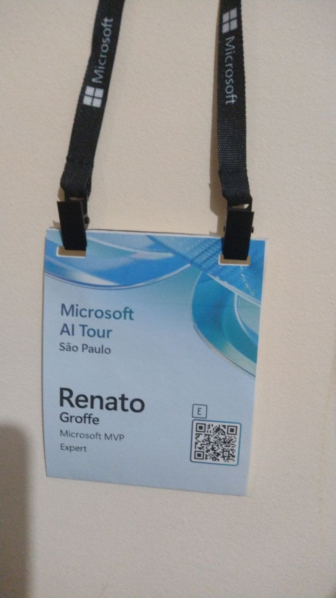
